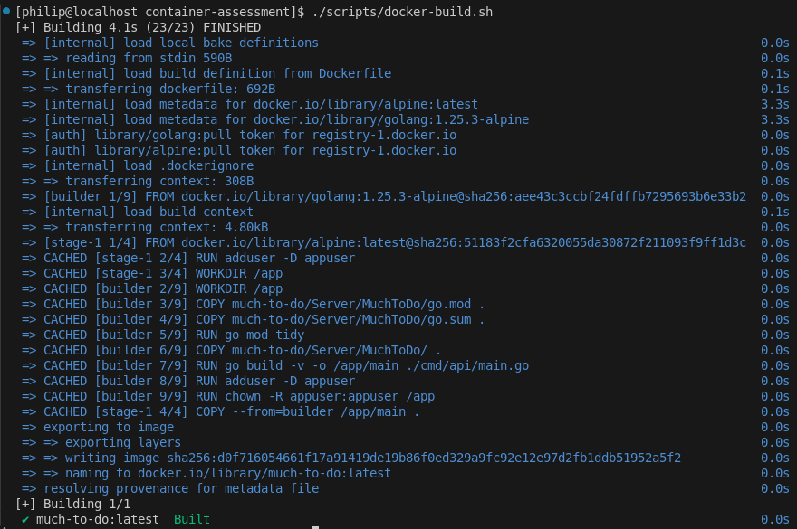
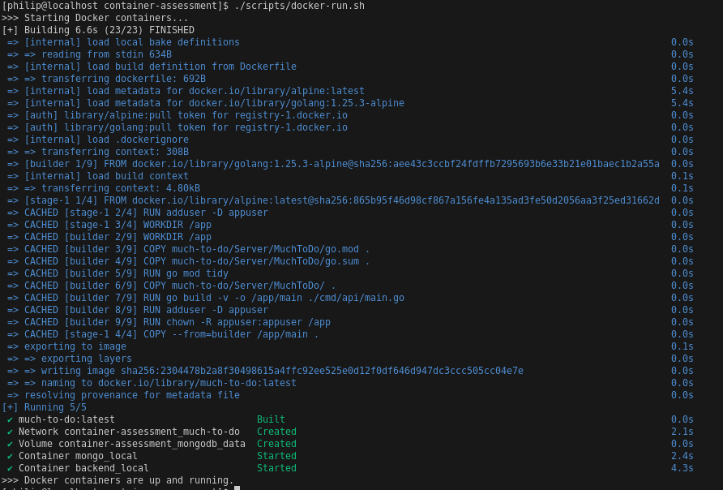
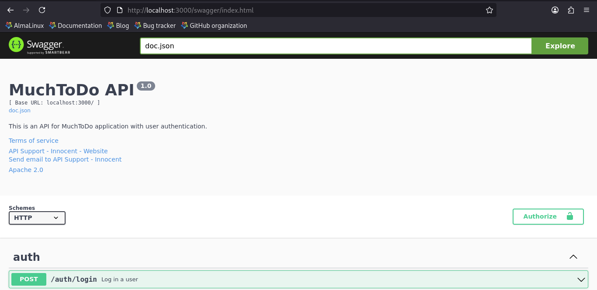
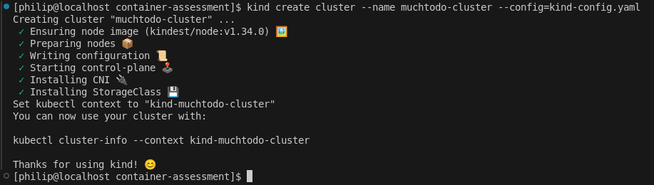
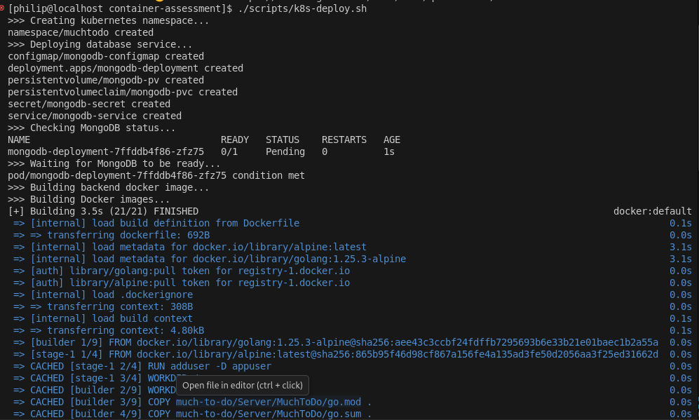
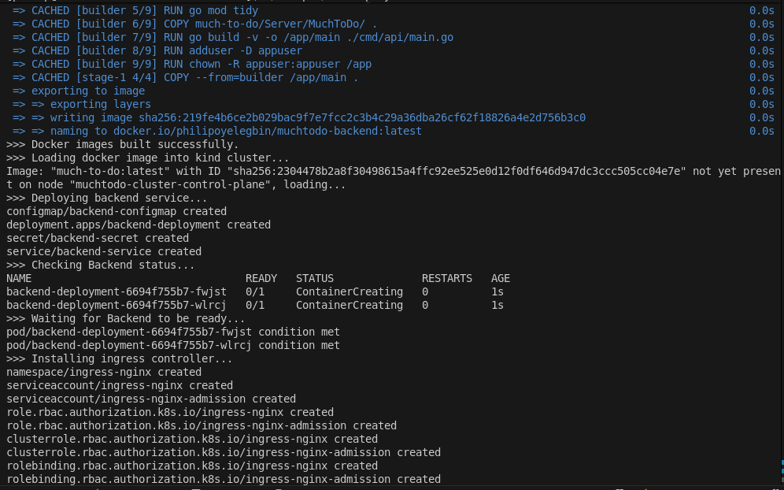
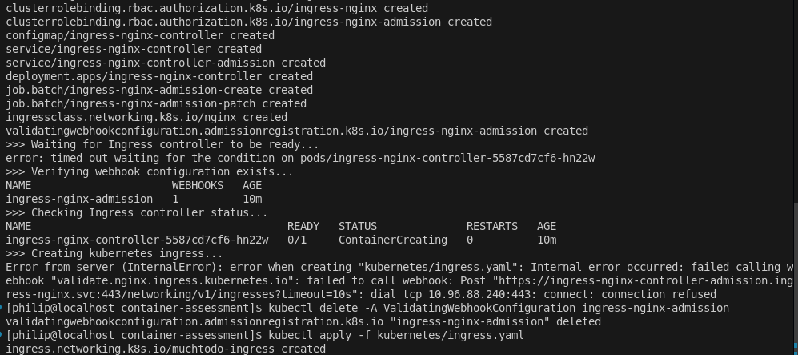
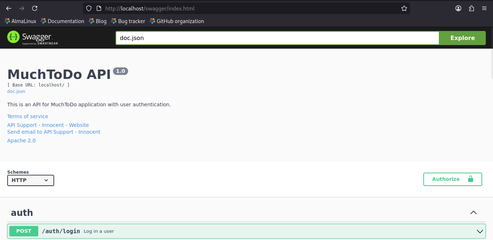
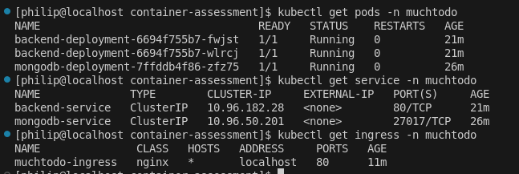

# Month 2 Assessment

This repository contains the containerized version of the MuchTodo backend API, a Golang-based service utilizing MongoDB. This project transitions the application from a direct server deployment to a modern, scalable infrastructure using Docker and Kubernetes (Kind).

---

## 🚀 Project Overview

The goal of this project is to provide a production-ready containerization strategy for the StartupTech backend.

- **Backend API:** Golang application
- **Database:** MongoDB for data storage
- **Orchestration:** Docker Compose (Development) & Kubernetes (Production-like local environment)

---

## 📂 Project Structure

```
container-assessment/
├── <application-code>
├── Dockerfile
├── docker-compose.yml
├── .dockerignore
├── kubernetes/
│ ├── namespace.yaml
│ ├── mongodb/
│ │ ├── mongodb-secret.yaml
│ │ ├── mongodb-configmap.yaml
│ │ ├── mongodb-pvc.yaml
│ │ ├── mongodb-deployment.yaml
│ │ └── mongodb-service.yaml
│ ├── backend/
│ │ ├── backend-secret.yaml
│ │ ├── backend-configmap.yaml
│ │ ├── backend-deployment.yaml
│ │ └── backend-service.yaml
│ └── ingress.yaml
├── scripts/
│ ├── docker-build.sh
│ ├── docker-run.sh
│ ├── k8s-deploy.sh
│ └── k8s-cleanup.sh
├── kind-config.yaml
└── README.md
```

---

## 🛠️ Prerequisites

Before starting, ensure you have the following installed:

- Docker Desktop or Docker Engine
- Kind (Kubernetes in Docker)
- kubectl
- Go 1.21+ (for local development)

---

## 🐳 Phase 1: Docker Setup

**Local Development**

To spin up the entire stack (API + MongoDB) with persistence and environment synchronization:

```bash
# Using the automation script
chmod +x scripts/docker-build.sh
./scripts/docker-build.sh

chmod +x scripts/docker-run.sh
./scripts/docker-run.sh

# Or manually
docker-compose up --build
```

The API will be available at http://localhost:8080.

**Optimization Features**

- Multi-stage Build: Reduces final image size by separating the build environment from the runtime.
- Security: Runs as a non-root user.
- Health Checks: Docker engine monitors the /health endpoint to ensure container viability.

**Cleanup**

To remove all running docker services

```bash
docker-compose down --volumes
```

---

## ☸️ Phase 2: Kubernetes Deployment

Used Kind to simulate a multi-node Kubernetes cluster locally.

**Create the Cluster**

```bash
kind create cluster --name muchtodo-cluster --config=kind-config.yaml
```

**Deploying to Cluster**

Run the deployment script to create the namespace, secrets, and workloads:

```bash
chmod +x scripts/k8s-deploy.sh
./scripts/k8s-deploy.sh
```

**Manifest Breakdown**

1. MongoDB: Deployed as a single replica with a Persistent Volume Claim (PVC) to ensure data survives pod restarts.
2. Backend: Deployed as a single replica
3. Ingress: Routes external traffic to the backend service.

**Cleanup**

To remove all Kubernetes resources and the namespace:

```bash
chmod +x scripts/k8s-cleanup.sh
./scripts/k8s-cleanup.sh
```

---

## 🔬 Troubleshooting

- Error encountered while installling ingress controller, was resolved by changing ISP provider

  > Unable to connect to the server: net/http: TLS handshake timeout

- Error encuntered while creating ingress was reslved by running the command below.

  > Error from server (InternalError): error when creating "kubernetes/ingress.yaml": Internal error occurred: failed calling webhook "validate.nginx.ingress.kubernetes.io": failed to call webhook: Post "https://ingress-nginx-controller-admission.ingress-nginx.svc:443/networking/v1/ingresses?timeout=10s": dial tcp 10.96.154.58:443: connect: connection refused

  ```bash
  # 1. Delete the problematic validating webhook
  kubectl delete -A ValidatingWebhookConfiguration ingress-nginx-admission

  # 2. Apply the Ingress again
  kubectl apply -f kubernetes/ingress.yaml
  ```

---

## 📸 Evidence

Screenshots of the successful deployment can be found in the /evidence directory, covering:

- Docker build process completion.

  

- Docker compose running successfully.

  

- Application responding via docker-compose (http://localhost:8080/swagger/index.html).

  

- Kind cluster

  

- Kubernetes deployments running

  
  
  

- Application accessible through a NodePort Service type to the host or Kubernetes ingress (http://localhost/swagger/index.html).

  

- Kubectl commands showing pod status, services, and ingress.

  

---
